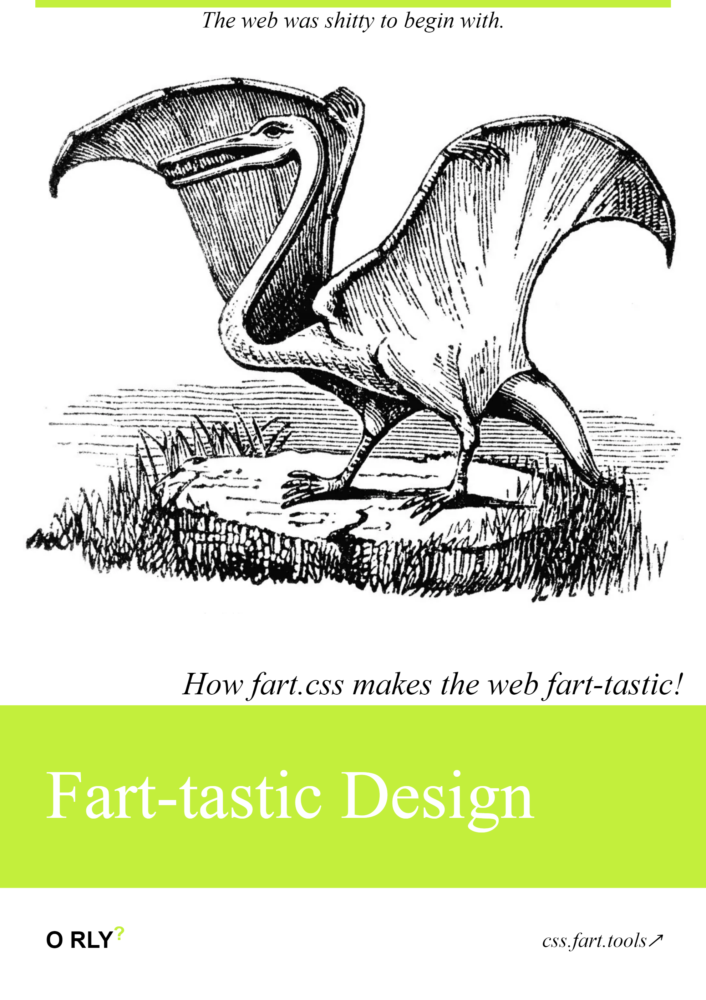

# fart.css

CSS library reusable across your ✨fart-tastic✨ frontends.

[](https://css.fart.tools)

## Usage

Import `fart.css` in the `<head>` of your HTML document.

```html
<link
  rel="stylesheet"
  type="text/css"
  href="https://css.fart.tools"
/>
```

## Documentation

Refer to <https://css.fart.tools> to learn how to use the fart.css CSS library
in your own ✨fart-tastic✨ frontends.

## Websites that use fart.css

- [fartlabs.org](https://github.com/FartLabs/fartlabs.org)
- [shop.fartlabs.org](https://github.com/FartLabs/shop)
- [css.fart.tools](https://github.com/FartLabs/css.fart.tools)
- [concentration.fart.tools](https://github.com/FartLabs/concentration)
- [etok.me](https://github.com/EthanThatOneKid/etok.me)
- [fart.johncarlomanuel.com](https://github.com/johncmanuel/fart.johncarlomanuel.com)
- [Fart Feedbacks](https://github.com/nancy-kataria/fart-feedbacks)

[Open an issue](https://github.com/FartLabs/fart.css/issues/new) to add your
website to this list.

---

Developed with 💖 [**@FartLabs**](https://github.com/FartLabs)
